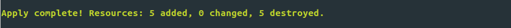

# 🚀 Deployment Proof - OWASP Juice Shop Secure Infrastructure

## 📋 Quick Setup Guide

### Prerequisites
```bash
# Required tools
- Vagrant 2.3+
- VirtualBox 7.0+
- Terraform 1.0+
```


### One-Command Deployment
```bash
# 1. Start Vagrant VM
cd vagrant && vagrant up

# 2. Deploy secure infrastructure
cd ../terraform && terraform init && terraform apply -auto-approve
```



## ✅ Automated Stack Testing

```bash
# Complete validation script
./validate.sh
```

## ✅ Validation Commands


### Infrastructure Status
```bash
# SSH into VM
vagrant ssh

# Check all security services
sudo systemctl status ufw fail2ban apparmor docker

# Verify firewall rules
sudo ufw status verbose

# Check Fail2ban jails
sudo fail2ban-client status
sudo fail2ban-client status sshd

# Verify AppArmor profiles
sudo aa-status | head -20

# Check Docker security
docker version
docker ps
sudo docker inspect juice-shop | grep -E "(SecurityOpt|Memory|CpuQuota)"
```

### Application Access
```bash
# Direct application access (should be blocked by firewall)
curl http://localhost:3000 # Expected: Connection refused

# Secure HTTPS access through reverse proxy
curl -k -I https://localhost:4443 # Expected: 200 OK with TLS headers

# Check TLS configuration
openssl s_client -connect localhost:443 -tls1_2 < /dev/null 2>/dev/null | grep -E "(Protocol|Cipher)"
```


### Security Validation
```bash
# Vulnerability scan report
cat /home/vagrant/trivy-report.txt

# Check security hardening
sudo sshd -T | grep -E "(MaxAuthTries|X11Forwarding|AllowTcpForwarding)"

# Verify container limits
docker stats juice-shop --no-stream

# Test intrusion prevention (simulate failed SSH attempts)
# This will trigger Fail2ban after 3 attempts:
# ssh -p 22 wronguser@localhost
```

## 📊 Expected Results

### Security Services Status
```
✅ ufw.service - Uncomplicated firewall (active)
✅ fail2ban.service - Fail2Ban Service (active) 
✅ apparmor.service - Load AppArmor profiles (active)
✅ docker.service - Docker Application Container Engine (active)
```

### UFW Firewall Rules
```
Status: active
Logging: on (medium)

To                         Action      From
--                         ------      ----
22/tcp                     ALLOW       Anywhere
80/tcp                     ALLOW       Anywhere
443/tcp                    ALLOW       Anywhere
3000/tcp                   DENY        Anywhere
```


### Fail2ban Jails
```
Status for the jail: sshd
|- Filter
|  |- Currently failed: 0
|  |- Total failed:     0
|  `- File list:        /var/log/auth.log
`- Actions
   |- Currently banned: 0
   |- Total banned:     0
   `- Banned IP list:
```

### Docker Container Security
```json
{
    "SecurityOpt": [
        "no-new-privileges:true"
    ],
    "Memory": 536870912,
    "CpuQuota": 50000
}
```


### TLS Configuration
```
Protocol  : TLSv1.2
Cipher    : ECDHE-RSA-AES256-GCM-SHA384
```


### AppArmor Security Profiles


## 🧪 Security Tests

### Test 1: Network Isolation
```bash
# Test: Direct access to Juice Shop should be blocked
curl --connect-timeout 5 http://localhost:3000
# Expected: curl: (7) Failed to connect to localhost port 3000: Connection refused
```

### Test 2: HTTPS Enforcement
```bash
# Test: HTTPS access should work
curl -k -I https://localhost:4443
# Expected: HTTP/2 200 OK with security headers
```

### Test 3: SSH Hardening
```bash
# Test: SSH configuration security
sudo sshd -T | grep MaxAuthTries
# Expected: maxauthtries 3

sudo sshd -T | grep X11Forwarding  
# Expected: x11forwarding no
```


### Test 4: Container Security
```bash
# Test: Container should run with security restrictions
docker inspect juice-shop | grep '"no-new-privileges:true"'
# Expected: "no-new-privileges:true"

docker stats juice-shop --no-stream | grep juice-shop
# Expected: Memory usage limited to ~512MB
```

### Test 5: Vulnerability Scanning
```bash
# Test: Trivy report should exist and show scan results
ls -la /home/vagrant/trivy-report.txt
# Expected: File exists with recent timestamp

head -10 /home/vagrant/trivy-report.txt
# Expected: Trivy scan results for juice-shop image
```

## 🔄 Troubleshooting

### Common Issues

#### Issue 1: VM not accessible
```bash
# Solution: Check Vagrant status
cd vagrant && vagrant status
vagrant reload  # if needed
```

#### Issue 2: Docker not running
```bash
# Solution: Restart Docker service
sudo systemctl restart docker
sudo systemctl status docker
```

#### Issue 3: Juice Shop not responding
```bash
# Solution: Check container logs
docker logs juice-shop
docker restart juice-shop
```

#### Issue 4: UFW blocking legitimate traffic
```bash
# Solution: Check UFW logs
sudo tail -f /var/log/ufw.log
# Adjust rules if necessary
```

## 📈 Performance Metrics

### Resource Usage
```bash
# System resources
free -h
df -h
top -bn1 | head -10

# Container resources  
docker stats juice-shop --no-stream
```

### Expected Performance
- **Memory usage:** < 512MB for Juice Shop container
- **CPU usage:** < 50% (limited by cgroup)
- **Disk usage:** < 2GB total for all containers and images
- **Network latency:** < 100ms for HTTPS responses

## 📚 Log Locations

| Service | Log Location | Purpose |
|---------|--------------|---------|
| UFW | `/var/log/ufw.log` | Firewall events |
| Fail2ban | `/var/log/fail2ban.log` | Intrusion attempts |
| SSH | `/var/log/auth.log` | Authentication events |
| Docker | `journalctl -u docker` | Container runtime |
| Nginx | `/var/log/nginx/` | Reverse proxy logs |
| AppArmor | `/var/log/kern.log` | Confinement violations |

## 🎯 Success Criteria

✅ **All security services running**  
✅ **Firewall blocking direct application access**  
✅ **HTTPS access working through reverse proxy**  
✅ **Container running with security restrictions**  
✅ **Vulnerability scanning operational**  
✅ **Intrusion prevention active**  
✅ **SSH hardening applied**  
✅ **AppArmor profiles loaded**  
✅ **Automated updates configured**  
✅ **Resource limits enforced**


**Deployment verified on:** Ubuntu 24.04 LTS with Vagrant/VirtualBox