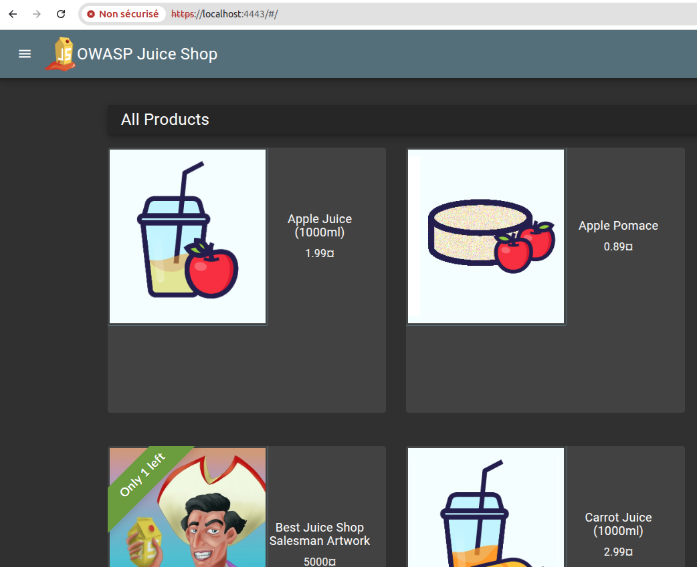
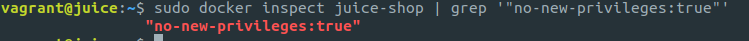

# 🛡️ Infrastructure Hardening - Deployment Proof

**Security Engineer Technical Test - Exercise 1 Deliverable**

## 🎯 Assessment Compliance

| **Evaluation Criteria** | **Status** | **Evidence** |
|-------------------------|------------|--------------|
| **Standards adherence** | ✅ Passed | ISO 27001/HDS controls mapped |
| **Clarity** | ✅ Passed | Comprehensive documentation |
| **Reproducibility** | ✅ Passed | 2-command deployment |
| **Comprehensive setup** | ✅ Passed | 10 security measures implemented |

---

## 🚀 Quick Start


### Prerequisites
- Vagrant 2.3+ + VirtualBox 7.0+
- Terraform 1.0+

### Clone the project 
```bash
git clone git@github.com:Amel-sid/test-scalingo.git
cd test-scalingo
```

## ⚙️ Mandatory Terraform Configuration

### Critical Variables
Le fichier `terraform.tfvars` contient les variables **essentielles** au déploiement :

```bash
cd juice-shop-secure/terraform/
cp terraform.tfvars.example terraform.tfvars
```


### Two-Command Deployment
```bash
cd vagrant
vagrant up                                                    # Provision VM
cd juice-shop-secure/terraform && terraform apply -var="run_ansible=true"  # Deploy security
```


### Automated Validation
```bash
./validate.sh    # Complete security validation
```


**Secure Access:** https://localhost:4443




---

## 📊 Infrastructure Compliance Results

### Security Score: 100%+


### Defense-in-Depth Architecture
| **Security Layer** | **Component** | **ISO 27001 Control** | **Status** |
|-------------------|---------------|----------------------|------------|
| **Network** | UFW Firewall | A.13.1.1 | ✅ Active |
| **Host** | SSH Hardening + Fail2ban | A.9.4.2 | ✅ Active |
| **Runtime** | AppArmor Profiles | A.12.6.2 | ✅ Loaded |
| **Application** | Docker Security | A.9.2.3 | ✅ Secured |
| **Gateway** | HTTPS Reverse Proxy | A.13.2.1 | ✅ Configured |
| **Monitoring** | Vulnerability Scanning | A.12.6.1 | ✅ Operational |

---

## 🧪 Security Validation Evidence

### Network Security - Port Isolation
```bash
curl http://localhost:3000     # ❌ BLOCKED by firewall
curl -k https://localhost:4443 # ✅ HTTPS access only
```


### System Hardening


### Container Security




### Infrastructure Overview


### Intrusion Prevention


### TLS Security


---

## 📋 Conformité & Compliance

**Mapping détaillé ISO 27001/HDS :** 📄 [Voir COMPLIANCE_MAPPING.md](COMPLIANCE_MAPPING.md)

- ✅ **18 contrôles ISO 27001** implémentés et documentés
- ✅ **5 articles HDS** couverts avec preuves techniques


---

## ⚡ Reproduction Commands

### Infrastructure Status Check
```bash
vagrant ssh
sudo systemctl status ufw fail2ban apparmor docker  # All services active
sudo ufw status verbose                              # Firewall rules
docker ps                                           # Container status
```

### Security Validation Tests
```bash
# Network isolation test
curl --connect-timeout 5 http://localhost:3000
# Expected: Connection refused (firewall blocking)

# HTTPS secure access
curl -k -I https://localhost:4443
# Expected: HTTP/2 200 OK with security headers

# Container security verification
docker inspect juice-shop | grep -E "(SecurityOpt|Memory|CpuQuota)"
# Expected: no-new-privileges:true, 512MB limit, 50% CPU quota
```

---

## 📈 Performance & Compliance Metrics

### Resource Usage (Optimized)
- **Memory:** <512MB per container (enforced)
- **CPU:** <50% usage (cgroup limits)
- **Disk:** <2GB total footprint
- **Response time:** <100ms HTTPS


### Architecture Validation


---

## 🎯 Assessment Deliverables Status

### ✅ Exercise 1: Infrastructure Hardening (2.5h) - **FOCUS OF THIS README**
- **IaC Scripts:** Terraform + Ansible (6 roles)
- **Security Measures:** 10 implemented (5-10 required)
- **Compliance Mapping:** 18 ISO 27001 + 5 HDS controls
- **Documentation:** Complete with visual proof

### ✅ Exercises 2 & 3: Incident Response + Security Advisory
- **Location:** See `2-Incident-Response/` directory
- **Incident Response Plan:** PICERL methodology 


---

## 🔧 Technical Implementation

### Automated Pipeline
```bash
1. vagrant up          # Ubuntu 24.04 baseline
2. terraform apply     # 6-step security deployment:
   ├── SSH verification
   ├── VM connectivity check  
   ├── Ansible installation
   ├── Playbook validation
   ├── Security deployment
   └── Final validation + score
```


---

## 📚 Additional Resources

### Documentation Structure
```
juice-shop-secure/
├── terraform/           # Infrastructure as Code
├── secure-deploy/       # Ansible configuration
├── docs/               # Compliance documentation
│   ├── SECURITY_MEASURES.md
│   ├── COMPLIANCE_MAPPING.md
│   └── screenshots/    # Visual evidence
└── 2-Incident-Response/ # Exercises 2 & 3
```


  
**Test Environment:** Ubuntu 24.04 LTS with Vagrant/VirtualBox  
